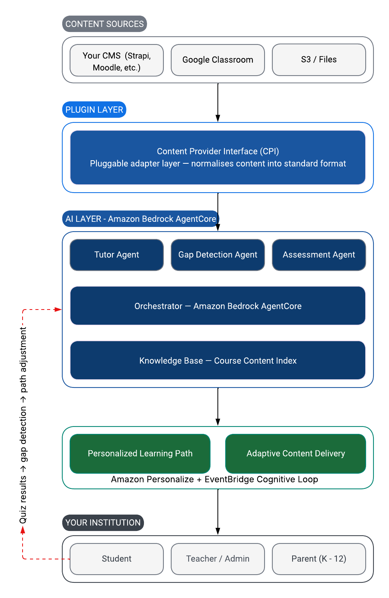
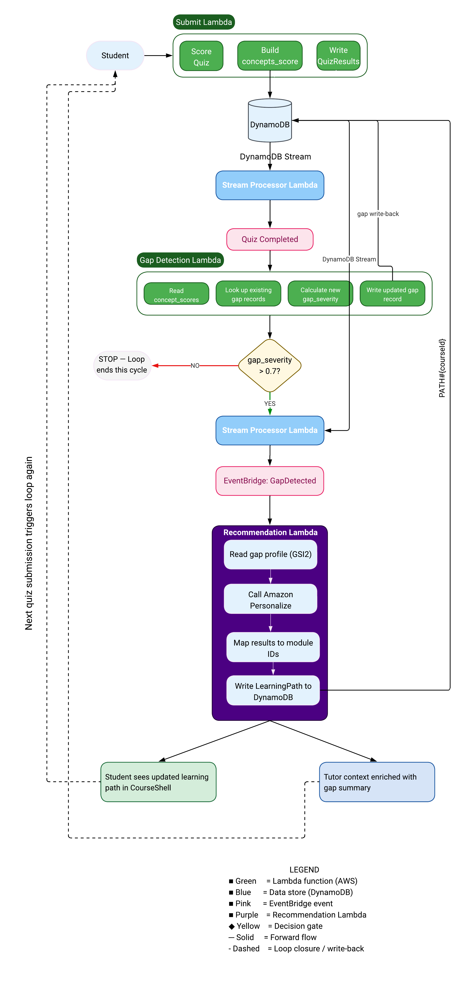

# CampusIQ Architecture

## Table of Contents

1. [Overview](#1-Overview)
2. [System Architecture](#2-System-Architecture)
3. [The Cognitive Learning Loop](#3-the-cognitive-learning-loop)
4. [Content Provider Interface](#4-content-provider-interface)
5. [Multi-Agent Design](#5-multi-agent-design)
6. [Authentication Architecture](#6-authentication-architecture)
7. [Data Architecture](#7-data-architecture)
8. [Technology Decisions](#8-technology-decisions)
9. [Deployment Model](#9-deployment-model)
10. [Extensibility](#10-extensibility)


## 1. Overview

CampusIQ is an AI powered adaptive learning platform that augments the learning delivery capabilities of institutions. 
Most of the learning management platforms that exist today are static in nature. They provide the same learning path to each 
student oblivious to the gaps in learning of each student. This leaves a very big gap in a student's ability to excel, since continued learning is built on top of what you already know
and if the previous concepts are weak it affects the future learning. 

CampusIQ is built on three core architectural principles. First, it is self-hosted. You deploy it to your own AWS account and hence none of your
student data ever leaves your infrastructure. Second, it is pluggable to your existing content management system (CMS). You continue to create content
as you do today, and CampusIQ works on top of that content seamlessly. No hassle to move content neither to learn any new CMS. CampusIQ has 
native integrations with Google Classroom, Strapi API, and S3 and can easily be integrated with any other CMS you use by implementing the plugin interface.
Third, it is AI-native — artificial intelligence is not bolted on top of the platform as an afterthought. It is the core delivery mechanism. 
The Cognitive Learning Loop, the AI Tutor, and the gap detection system are not optional add-ons — they are the platform.

These three features makes CampusIQ unique from the existing LMS. Self-hosted AI native learning platforms do not exist today. You either have to 
subscribe to a SaaS platform, which means your student data lives on someone else's servers, or you build a custom solution on top to provide AI capabilities, which is hard and time-consuming. 


## 2. System Architecture

CampusIQ is organised into four layers that work together as a
closed feedback loop. Each layer has a distinct responsibility but
no layer operates independently — content flows into intelligence,
intelligence drives delivery, and delivery generates data that
feeds back into intelligence.



### 2.1 Content Sources Layer

CampusIQ has a plugin architecture that allows you to bring your
own CMS — Google Classroom, Strapi, or S3. It also has a built-in
content creation layer for institutions that do not have an existing
CMS. The Content Plugin Interface (CPI) normalises content into a
standard format that the CampusIQ backend understands. Content is
ingested into an S3 bucket in your own AWS account — this ensures
the AI layer is not dependent on the CMS being available and
eliminates latency from live API calls during a student session.
The ingested content forms the Knowledge Base for Amazon Bedrock
on which the language models ground their answers. The AI layer
never talks to the CMS directly — only to the CPI.

### 2.2 AI Intelligence Layer

The AI intelligence layer comprises Orchestrator and Tutor Agent that runs in Amazon Bedrock AgentCore.
The Orchestrator enriches the context with the student's gap summary before sending it to Tutor Agent. The Tutor
Agent gets this enriched context and uses it to answer any questions - tie up with the previous concepts
that the student has gap in. The tutor agent always grounds its answers in the actual content which forms the basis
for Amazon Bedrock Knowledge Base. The AI intelligence layer also has four Lambdas - Gap Detection - responsible for translating the quiz performance into a concept-level
weakness model for the student , Recommendation - responsible for taking the gap signal and translating it into a concrete learning path, 
Content Adaptation, Assessment

### 2.3 Adaptive Delivery Layer

The adaptive delivery layer is the mechanism through which the Cognitive Learning Loop's output reaches the student. A student's  learning path is personalized based on the gap
profile. Amazon Personalize ingests this gap profile and interaction history and produces the personalized learning path for the student. 
The interaction between components is asynchronous and event-driven, orchestrated by Amazon EventBridge. The personalized learning path is stored in 
DynamoDB and read by CourseShell - the navigation container that presents the personalized module sequences to the student. The whole process is automated without any teacher intervention. The learning path record has a 24-hour TTL that ensures
that the CourseShell is always displaying the recent state and not a stale snapshot.

### 2.4 Analytics Layer

The analytics layer is responsible for translating the student's interaction data into actionable insights for the teachers and administrators. 
DynamoDB streams feed the analytics pipeline -  data flows from DynamoDB Streams through a Lambda processor into an S3 analytics lake,
where AWS Glue crawls and catalogues it, Athena queries it, and QuickSight renders it as a faculty dashboard. The dashboard comprises four panels: class health showing average mastery scores
and at-risk student counts, a concept gap heatmap showing which concepts the cohort is collectively struggling with, a student progress timeline showing individual 
mastery trajectories over time, and a content effectiveness scoreboard ranking modules by the quiz score improvements they produce.
0.7 is defined as the gap_severity threshold and a gap_severity value > 0.7 triggers an SNS alert to the teacher. The analytics layer never queries the operational DynamoDB table  
freeing it for low-latency student interaction. All the analytics reads go through the S3 lake via Athena.

### 2.5 How the Layers Connect

The content from the content management system flows through the content plugin interface, which standardizes the content to CampusIQ standard format and pushes to an S3
bucket, which is used as the data source for Bedrock Knowledge Base. Whenever a student submits a quiz, the quiz
results are calculated and recorded in DynamoDB from where they are streamed via EventBridge to the Gap Detection lambda
that calculates the gap_severity and writes to the DynamoDB. If the gap_severity threshold value (>= 0.7) is breached the EventBridge event
is triggered and the Recommendation Lambda calls Amazon Personalize and Personalize updates the learning path. 
Next time the student logs into CampusIQ and opens CourseShell they are presented the updated LearningPath. 
Whenever a student asks a question to the Tutor Agent, the Orchestrator injects gap context and the tutor grounds its answer in Bedrock Knowledge Base. 
All interactions are routed through the DynamoDB streams to the analytics pipeline which feeds the Faculty Dashboard. 

No layer in the whole system operates in isolation. Every student interaction generates a signal that propagates through the system and eventually reshapes
the student's experience.


## 3. The Cognitive Learning Loop

Cognitive learning focuses on internal mental processes in learning. Learning is not passive - it requires
learners to actively process information, and that processing happens at a different rate and depth for each individual. 
Most of the learning management systems that exist today have a static learning framework and are oblivious to this reality. 
A student who struggles with Newton's laws of motion in Week 3 receives the same Week 4 content
as a student who has mastered the concept. The platform is unaware of this gap and has no mechanism to identify and respond to it - every student
continues on the same path regardless of whether they understood the previous concept or not.  

CampusIQ overcomes this limitation through what we call the "Cognitive Learning Loop" - a closed-feedback system that  triggers on every quiz submission, 
where specialized components process that signal and adjust the student's learning path in real-time. 


### 3.1 The Entry Point — Quiz Submission

Quiz submission is the single entry point to the Cognitive Learning Loop, everything else in the system is triggered by this event.  
This is deliberate since quiz performance is the most reliable signal of genuine comprehension. Other indicators and metrics
such as time on page or video play percentage are easy to fabricate. 

When a student submits a quiz the following sequence occurs:

1. The frontend calls POST /api/v1/courses/{courseId}/modules/{moduleId}/quiz/submit
2. The Submit Lambda scores the quiz by comparing answers against correct_ids and calculates score_pct
3. The Lambda builds the concept_scores map — mapping each concept to a score between 0.0 and 1.0 based on the questions tagged with that concept
4. The QuizResult record is written to DynamoDB with the concept_scores map stored on it

The concept_scores map is the signal that drives the entire loop. Without concept_scores the system has no way of
translating a quiz result into concept identifiers. The platform knows that a student scored 65% on the quiz but has no
way of knowing which concepts are weak and which are strong. 
**Concept Score Map**

Example concept_scores on a Physics Week 3 quiz result. In this example the student scored well on inertia but struggled with friction, acceleration, and Newton's Third Law.
```json
    
          {
              "friction":      0.4,   
              "inertia":       0.9,   
              "acceleration":  0.7,   
              "newtons_third": 0.5  
          }
```

The `concept_scores` map becomes possible because of concept tagging.
Without it the system has no way to identify which concepts are weak.
The `concept` field on each question is what enables this mapping —
the Assessment Lambda sets it when generating the quiz draft and the
teacher can edit it when reviewing.
```json
              {
                  "id":      "q1",
                  "type":    "SINGLE",
                  "text":    "Which of Newton's laws describes inertia?",
                  "concept": "inertia",    
                  "correct_ids": ["a"]
              }
```
### 3.2 Gap Detection

Once the quiz results are written to the DynamoDB, the stream processor lambda fires QuizCompleted event. This event has an EventBridge
rule on it that routes the events to the Gap Detection Lambda. This lambda is responsible for translating the quiz performance into a concept-level
weakness model for the student. 

Following sequence of steps occur inside it:
1. Read concept_scores map from the event. 
2. Look up existing gap records for each concept.
3. Calculate new gap_severity.
4. Write updated gap record to DynamoDB.

The gap_severity scoring model calculates the gap in a student's understanding of the concepts. It is the inverse of the concept mastery and is 
calculated on a scale of 0.0 to 1.0 with 0.0 means complete mastery and 1.0 means completely unknown. 0.7 is defined as the risk-threshold.

| gap_severity | 	Meaning                                                               | 	Action                                                                                       |
|--------------|------------------------------------------------------------------------|-----------------------------------------------------------------------------------------------|
| 0.0 – 0.3    | 	Strong — student has demonstrated consistent mastery of this concept	 | No action. Path does not prioritise this concept.                                             |
| 0.3 – 0.6    | 	Developing — student partially understands but has some gaps	         | Noted. Tutor Agent aware but no path change triggered.                                        |
| 0.6 – 0.7	   | Weak — student is consistently struggling with this concept	           | Noted. Included in Orchestrator context enrichment. Path may adjust.                          |
| 0.7 – 1.0    | 	At-risk threshold exceeded — student has a significant knowledge gap	 | GapDetected EventBridge event fires. Recommendation Lambda triggered. Faculty alert may fire. |

While calculating gap_severity, recent attempts are weighted more than older ones so that the system reflects current state not historical average. 
As an example, if a student scored [0.4, 0.3, 0.5] in friction across 3 quizzes the weighted average is approximately 0.41 and the gap_severity = 1.0 - 0.41 = 0.59

The gap_severity is written to the DynamoDB stream and the Stream Processor Lambda checks the new gap_severity. If it exceeds 0.7, a second
EventBridge event fires - GapDetected and the loop continues. If the gap_severity is below 0.7, the loop stops for this cycle. 

0.7 is the loop's gating threshold to prevent the Recommendation Lambda from running after every quiz submission - which would
be wasteful and disruptive. It is invoked only when the student has demonstrated genuine weakness in a concept. This threshold is configurable in the
domain config file. 

### 3.3 - Learning Path Adaptation

Based on the gap_severity value (>0.7) the Recommendation Lambda is triggered. This lambda is responsible for taking the gap signal and translating it into a concrete learning path - an ordered list of
modules the student should work through next. 

Following sequence of steps occur inside it:
1. Read student's full gap profile from DynamoDB.
2. Call Amazon Personalize get_recommendations endpoint with student ID and gap context as item metadata.
3. Map Personalize recommendations to module IDs
4. Write updated LearningPath to DynamoDB.

The Recommendation Lambda reads the student's gap profile by querying GSI2 - PK = STUDENT#{sub}, ScanIndexForward=False and get all the gaps sorted by severity descending as response. Top 5 weakest
concepts are returned. Once the gap context is returned, the Lambda calls Amazon Personalize and pass it student ID and gap context as metadata. Personalize then returns ranked content recommendations based on student's interaction
history and gap profile.

*Personalize requires interaction history to make good recommendations but when CampusIQ is first deployed for an institution it does not have any interaction history. This is called the cold start problem.
Since it does not have any interaction history, Personalize during cold start falls back to popularity-based recommendations - it recommends modules that most students at that difficulty level engage with. So 
it is not personalized, but not completely random either. As students use the platform and interaction events accumulate, Personalize learns patterns, and it updates its model automatically as new interactions arrive - no manual retraining is needed.*

Once the LearningPath is returned it is then updated in DynamoDB.

```json
{
    "PK":                   "STUDENT#cognito-sub-abc",
    "SK":                   "PATH#phys101",
    "course_id":            "phys101",
    "recommended_modules":  [
        "week3-friction-remediation",   
        "week3-newtons-laws",           
        "week4-forces",                
        "week2-dynamics-review"   
    ],
    "current_module_id":    "week3-friction-remediation",
    "rationale":            "Prioritising friction remediation — gap severity 0.8. Newton's Third Law also flagged.",
    "generated_at":         "2026-03-15T14:23:00Z",
    "expires_at":           "2026-03-16T14:23:00Z",
    "ttl":                  1773936180
}

```
The LearningPath has a 24-hour TTL. This is done intentionally to ensure that the path is always based on the student's most
recent state and not a week-old snapshot. If when the student loads their course and the path is not found, the learning-path endpoint
triggers a fresh Personalize recommendation synchronously before responding. 

When a student logs into the platform and open CourseShell, the learning path endpoint is called. The fresh LearningPath record is read, which
reflects the gap detection and the student is guided toward remediation content without any manual teacher intervention. 

GET /api/v1/students/me/courses/phys101/learning-path
Response
```json

{
    "course_id": "phys101",
    "recommended_modules": [
        {
            "module_id": "week3-friction-remediation",
            "title":     "Understanding Friction — A Closer Look",
            "rationale": "Recommended based on recent quiz performance"
        },
        {
            "module_id": "week3-newtons-laws",
            "title":     "Newton's Laws of Motion",
            "rationale": "Re-attempt after remediation"
        }
    ],
    "current_module_id": "week3-friction-remediation",
    "generated_at":      "2026-03-15T14:23:00Z",
    "expires_at":        "2026-03-16T14:23:00Z"
}

```
###  3.4 — Tutor Context Enrichment

Every time a student asks the AI Tutor a question, the Orchestrator is called. One of the orchestrator
agent jobs is context enrichment - it injects the student's current gap summary into the prompt before dispatching
it to the Tutor Agent. 

For building the gap summary, the Orchestrator reads the student's top gaps from DynamoDB via GSI2. It then
injects this gap summary into the Tutor Agent's system prompt alongside student's active learning path and domain config. 

Enriched Context 
```json
{
    "student_profile": {
        "name":   "John Smith",
        "domain": "university",
        "grade":  "sophomore"
    },
    "gap_summary": [
        {"concept": "friction",      "severity": 0.8, "label": "needs-attention"},
        {"concept": "newtons_third", "severity": 0.5, "label": "developing"},
    ],
    "active_learning_path": {
        "current_module": "week3-friction-remediation",
        "next_module":    "week3-newtons-laws"
    },
    "domain_config": {
        "tutor_persona": "You are a university-level physics tutor...",
        "temperature":   0.7
    }
}

```
The Tutor Agent's system prompt includes the gap context explicitly.
For example — if a student has a friction gap of 0.8, the prompt
instructs the Tutor to proactively connect answers about Newton's
Laws to friction concepts, even if the student did not ask about
friction directly.

Without the gap context, the Tutor Agent is reactive and only answers the question that the student asks. With gap context, the
Tutor Agent becomes proactive since it now has the context about the gap and ties its response to the weak area. The student 
receives targeted help even when they do not know to ask for it. 

## 4. Content Provider Interface

Content Provider Interface (CPI) separates the institution's content management system from the CampusIQ platform. The CPI layer acts as a boundary beyond which the platform
doesn't need to know anything about the CMS. The institutions integrate their CMS with CampusIQ by implementing the CPI - a standard contract that transforms CMS specific content
into a format CampusIQ understands. This is what distinguishes CampusIQ as a framework rather than a platform - the AI layer works without any CMS modification. 

### 4.1 The Standard Contract

The CPI defines five actions that every plugin must implement - fetch_content fetches a single content item from the CMS by course and module ID, 
search_content searches for content items matching a query string, list_courses lists all available courses from the CMS, 
get_metadata returns metadata for a specific content item, ingest_content triggers the ingestion of content into the CampusIQ knowledge base pipeline. 

Every plugin must return a CPIContent object - the standard output that the CampusIQ platform consumes. CPIContent object carries
the content_id, title, content_type, and metadata including domain, difficulty, and the source CMS. The content itself is carried in three
optional fields depending on the type of content - body carries Markdown text for rich text content, content_url carries the S3 object keys
for PDFs, and video_url and transcript_url carry the HLS stream URL and WebVTT path respectively for video content. It is a deliberate
decision to only populate the relevant field to make the contract explicit about what type of content each response carries and prevents the platform
from having to guess. So as an example, a PDF response sets content_url and leaves body and video_url empty. 

### 4.2 Built-in Plugins

Out of the box CampusIQ provides three built-in plugins. The S3 plugin is the default and is the correct choice for institutes that create the content directly in CampusIQ. 
S3 plugin requires no external CMS - the content is read from the institution's own S3 bucket and is stored in a convention-based folder structure following the pattern
{domain}/{courseId}/modules/{moduleId}/content.md. The Google Classroom plugin connects via the Classroom API v1 and Drive API v3 for fetching coursework and attachments. Google 
Cloud Pub/Sub webhooks are configured to receive real-time notifications when a new course is published. To maintain continuity, the plugin re-registers with Pub/Sub every five days because the registrations
expire after every seven days. The Strapi plugin connects via the Strapi REST API v4. Since different Strapi installations use different field names for the same content, field names are made configurable 
via campusiq.config.json rather than hardcoded. A template plugin also ships in the repository at src/application/plugins/content_plugin_interface/template as a starting point for building integrations
with any other CMS. 

### 4.3 Content Ingestion Pipeline

Once the CPIContent object is returned by the plugin, the ingestion Lambda takes over, and it routes based on content_type. 
Markdown content is saved as .md, PDF content is saved as .pdf to the institution's own S3 bucket in the convention-based folder structure. The video content 
after saving to S3 triggers two parallel events - MediaConvert transcodes the video to HLS for adaptive streaming and Transcribe generates a WebVTT transcript. 
Also, every S3 write automatically triggers Bedrock Knowledge Base sync to ingest the new content and make available to the Tutor Agent. 
As content moves through the pipeline an ingestion manifest is written to DynamoDB tracking the status from pending to processing to complete. The teachers can check this status via the API to know 
when the new content is available to students. An important architectural decision is to make the ingestion pipeline opaque to the internally created or externally uploaded content. The same ingestion pipeline 
is triggered and performs the same steps whether CampusIQ is used for content creation or any other CMS. The AI layer makes no distinction. This is what the Unified Ingestion Pipeline pattern means in practice. 

### 4.4 Adding a Custom Plugin

Adding a new CMS plugin requires no changes to the CampusIQ platform. The plugin class must extend the ContentPluginInterface and implement its five abstract methods - fetch_content, search_content, 
list_courses, get_metadata, and ingest_content - and register the plugin type in campusiq.config.json. In case, the new CMS uses non-standard field names, add a field_mapping section to the config file mapping
non-standard to the standard field names, and the platform will read from it at runtime. The template plugin at src/application/plugins/content_plugin_interface/template is the recommended starting point - it 
includes the class skeleton, method signatures, and inline documentation. See docs/cms-plugin-guide/ for the full implementation. 
